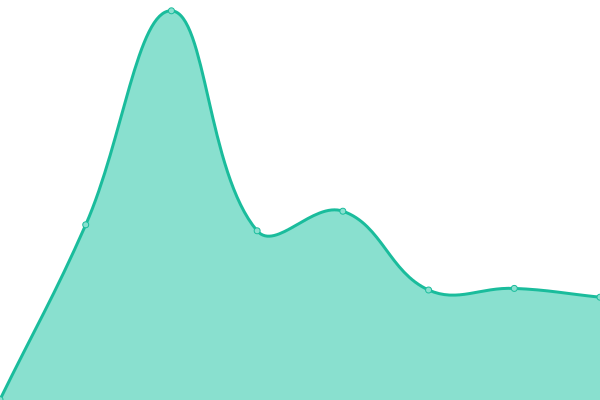

# [📈 Live Status](https://demo.upptime.js.org): <!--live status--> **🟧 Partial outage**

This repository contains the open-source uptime monitor and status page for [Gradesta](https://gradesta.com), powered by [Upptime](https://github.com/upptime/upptime).

With [Upptime](https://upptime.js.org), you can get your own unlimited and free uptime monitor and status page, powered entirely by a GitHub repository. We use [Issues](https://github.com/upptime/upptime/issues) as incident reports, [Actions](https://github.com/auto-mat/automat-statuspage/actions) as uptime monitors, and [Pages](https://demo.upptime.js.org) for the status page.

<!--start: status pages-->
<!-- This summary is generated by Upptime (https://github.com/upptime/upptime) -->
<!-- Do not edit this manually, your changes will be overwritten -->
<!-- prettier-ignore -->
| URL | Status | History | Response Time | Uptime |
| --- | ------ | ------- | ------------- | ------ |
|  [Main site - gradesta.com](https://www.gradesta.com) | 🟩 Up | [main-site-gradesta-com.yml](https://github.com/gradesta/gradesta-statuspage/commits/HEAD/history/main-site-gradesta-com.yml) | 

 656ms
     
 | 

<a href="https://gradesta.github.io/gradesta-statuspage/history/main-site-gradesta-com">100.00%</a>
    

|  [Goodnight gradesta - goodnight.gradesta.com](https://goodnight.gradesta.com) | 🟥 Down | [goodnight-gradesta-goodnight-gradesta-com.yml](https://github.com/gradesta/gradesta-statuspage/commits/HEAD/history/goodnight-gradesta-goodnight-gradesta-com.yml) | 

 0ms
     
 | 

<a href="https://gradesta.github.io/gradesta-statuspage/history/goodnight-gradesta-goodnight-gradesta-com">0.00%</a>
    

|  [Gradesta open source project site - gradesta.org](https://gradesta.org) | 🟩 Up | [gradesta-open-source-project-site-gradesta-org.yml](https://github.com/gradesta/gradesta-statuspage/commits/HEAD/history/gradesta-open-source-project-site-gradesta-org.yml) | 

 383ms
     
 | 

<a href="https://gradesta.github.io/gradesta-statuspage/history/gradesta-open-source-project-site-gradesta-org">100.00%</a>
    

<!--end: status pages-->

[**Visit our status website →**](https://gradesta.github.io)

## 📄 License

- Powered by: [Upptime](https://github.com/upptime/upptime)
- Code: [MIT](./LICENSE) © [gradesta](https://gradesta.github.io)
- Data in the `./history` directory: [Open Database License](https://opendatacommons.org/licenses/odbl/1-0/)
